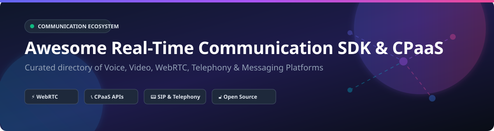

# Awesome Real-Time Communication SDK & CPaaS Ecosystem 🚀

  
  
  
  

## 📌 Top Real-Time Communication SDK (CPaaS) Ecosystem

**Curated Directory of Commercial SaaS Products & Open-Source GitHub Projects**  
*Focused on Voice, Video, WebRTC, Telephony, Audio Streaming & Messaging APIs for Developers*  

📅 **Last updated: October 2026**

---

### 🔍 Search Keywords & SEO Topics
`real-time communication` • `cpaas` • `webrtc-sdk` • `video-conferencing-api` • `voice-api` • `programmable-sms` • `open-source-webrtc` • `sip-server` • `sfu-mediaserver` • `telephony-sdk` • `livekit` • `jitsi` • `twilio-alternative` • `agora-sdk`

---

## 📖 Description
This repository tracks notable **commercial CPaaS platforms** and **open-source infrastructure projects** that provide APIs and SDKs for embedding voice, video, SMS, and messaging into applications. These tools range from programmable telephony to WebRTC video SDKs and omnichannel communication APIs.

**Commercial Examples** include Amazon Chime SDK, Twilio, Agora.io, Vonage, Sinch, Plivo, Telnyx, Infobip, Dyte, and Daily.co.

**Open-Source Emphasis**: Real-time communication is one of the strongest open-source domains. **Jitsi**, **LiveKit**, **Rocket.Chat**, **Mattermost**, **Matrix/Element**, **mediasoup**, **Janus**, and **OpenVidu** provide production-grade WebRTC & messaging infrastructure. **Asterisk**, **FreeSWITCH**, **Kamailio**, and **OpenSIPS** power telephony. **Pion** brings pure Go WebRTC, **Coturn** provides STUN/TURN NAT traversal, and **Galene** offers lightweight conferencing.

---

## 📑 Table of Contents
- [🏢 SaaS / Hosted Platforms](#-saas--hosted-platforms)
- [🔓 Open-Source GitHub Projects](#-open-source-github-projects)
  - [📹 WebRTC Platforms & SFU Media Servers](#-webrtc-platforms--sfu-media-servers)
  - [💬 Messaging, Team Chat & Federated Protocols](#-messaging-team-chat--federated-protocols)
  - [📞 Telephony, PBX & SIP Infrastructure](#-telephony-pbx--sip-infrastructure)
  - [🌐 Network Infrastructure & NAT Traversal](#-network-infrastructure--nat-traversal)
- [🛠️ How to Contribute](#%EF%B8%8F-how-to-contribute)
- [⚠️ Disclaimer & Technical Considerations](#%EF%B8%8F-disclaimer--technical-considerations)
- [❤️ Support & Sponsorship](#%EF%B8%8F-support--sponsorship)
- [📊 Star History](#-star-history)

---

## 🏢 SaaS / Hosted Platforms

> **📊 Market Analysis**: The global CPaaS (Communication Platform-as-a-Service) market size is estimated at **$27.2B – $32.0B** (2025–2026) with a projected CAGR of ~28%. The sector is **moderately fragmented**, with top-tier players holding ~45-60% market revenue share alongside numerous specialized regional and niche API providers.

| Provider | Overview / Focus | Company Size (Revenue / Valuation) | Pricing | Free Tier / Trial Limit |
| :--- | :--- | :--- | :--- | :--- |
| **[Amazon Chime SDK](https://aws.amazon.com/chime/chime-sdk/)** | AWS real-time voice, video, and messaging SDK for AWS-native applications. | **$2.65T+** Valuation (Parent Amazon) / **$42.2B/qtr** (AWS Revenue) | $0.0017/attendee-min (Audio), $0.0040/attendee-min (Video) | 10,000 attendee minutes/month free trial credit across AWS free tier |
| **[Twilio](https://www.twilio.com/)** | Market-leading CPaaS platform providing programmable voice, video, SMS, and messaging APIs. | **$4.46B** Revenue (2024) / **$43B** Market Cap | $0.0083/SMS, $0.0140/min Voice outbound, $0.0040/min WebRTC | $15.00 trial credit balance (expires after 30 days) |
| **[Sinch](https://www.sinch.com/)** | Cloud communications platform for SMS, voice, video, and omnichannel customer engagement. | **$2.55B** (SEK 27.1B) Revenue / **$3.1B** Market Cap | $0.0085/SMS, $0.0100/min Voice PSTN | 14-day free trial with test virtual phone number & test credits |
| **[Infobip](https://www.infobip.com/)** | Enterprise omnichannel communication platform covering SMS, Voice, WhatsApp, and Email. | **$2.0B+** Revenue (ARR) / **$1.1B** Valuation | $0.0080/SMS base rate, custom tiered enterprise rates | Sandbox account with 100 free test messages & trial credits |
| **[Vonage](https://www.vonage.com/)** | Ericsson subsidiary providing programmable voice, video, SMS, and messaging APIs (formerly Nexmo). | **$1.4B** Revenue / **$6.2B** Acquisition Valuation (Ericsson subsidiary) | $0.0081/SMS, $0.0154/min Voice, $0.0041/min Video | €2.00 free trial developer API credit |
| **[Telnyx](https://telnyx.com/)** | Global communications platform offering voice, SMS, wireless/IoT, and SIP trunking APIs. | **~$250M** Revenue (Est.) / **Private** | $0.0040/SMS, $0.0020/min Voice, $1.00/mo local phone number | $10.00 free test credit upon developer account verification |
| **[Agora.io](https://www.agora.io/)** | Real-time engagement platform specializing in voice, video, and interactive streaming SDKs. | **$141.1M** Revenue (2025) / **$345M** Market Cap | $0.99/1k mins Audio ($0.00099/min), $3.99/1k mins SD Video | 10,000 free participant-minutes per month (recurring forever) |
| **[Plivo](https://www.plivo.com/)** | Developer-friendly cloud communication platform specializing in cost-effective voice and SMS APIs. | **$100M** Revenue / **Private** (~$500M Est. Valuation) | $0.0050/SMS, $0.0035/min Voice outbound, $0.0030/min WebRTC | $10.00 free developer trial credits (valid for 3 weeks) |
| **[Daily.co](https://www.daily.co/)** | Real-time WebRTC video and audio SDKs for rapid video call integration. | **~$15M** Revenue (Est.) / **$70M** Total Funding (Series B) | $0.0040/participant-min (Video/Audio) | 10,000 free participant-minutes per month (recurring forever) |
| **[Dyte](https://dyte.io/)** | Real-time video and voice SDKs with pre-built UI components for custom video app integration. | **~$8.4M** Revenue / **$1.5M** Total Funding (YC W22) | $0.0020/participant-min (Video/Audio) | 10,000 free participant-minutes per month (recurring forever) |

---

## 🔓 Open-Source GitHub Projects

*Sorted by GitHub Stars_Count (Descending)* ⭐

### 📹 WebRTC Platforms & SFU Media Servers

- **[Jitsi Meet](https://github.com/jitsi/jitsi-meet)**   
  🎥 **Leading open-source video conferencing platform** (Apache-2.0). WebRTC-based with scalable SFU architecture, embeddable via IFrame API and native mobile SDKs. Best for self-hosted video meetings.

- **[LiveKit](https://github.com/livekit/livekit)**   
  ⚡ **High-performance WebRTC developer stack** (Apache-2.0). Scalable Go SFU backend with client SDKs for JS/TS, React, Swift, Kotlin, Flutter, Python, Go, and Unity. Best for custom real-time video/audio apps & AI voice agents.

- **[Pion WebRTC](https://github.com/pion/webrtc)**   
  🐹 **Pure Go implementation of WebRTC** (MIT). Zero Cgo dependencies, modular architecture for custom SFUs, MCU, and data channel servers. Best for Go-native RTC infrastructure.

- **[Janus WebRTC Server](https://github.com/meetecho/janus-gateway)**   
  🧩 **General-purpose C WebRTC Gateway** (GPL-3.0). Modular plugin architecture supporting VideoRoom, SIP gateway, RTSP streaming, and AudioBridge. Best for flexible WebRTC routing.

- **[mediasoup](https://github.com/versatica/mediasoup)**   
  🚀 **Cutting-edge WebRTC SFU library** (ISC). High-performance C++ core with Node.js & Rust bindings. Best for building bespoke multi-party video conferencing engines.

- **[OpenVidu](https://github.com/OpenVidu/openvidu)**   
  📦 **Complete WebRTC application platform** (Apache-2.0). High-level abstractions for multi-party video calls with ready-made client SDKs for JS, Angular, React, Vue, iOS, and Android.

- **[Kurento](https://github.com/Kurento/kurento)**   
  🛠️ **WebRTC media server & framework** (Apache-2.0). Advanced media processing pipelines including computer vision, augmented reality filters, and recording.

- **[MiroTalk P2P](https://github.com/mirotalk/mirotalk)**   
  🔒 **Simple, secure WebRTC peer-to-peer video calls** (AGPL-3.0). Zero-installation browser conferencing with screen sharing and chat.

- **[Galene](https://github.com/jech/galene)**   
  🍃 **Lightweight Go video conferencing server** (MIT). Designed for low-resource servers, lectures, and small team video meetings.

- **[SIP.js](https://github.com/onsip/SIP.js)**   
  🌐 **JavaScript SIP library for WebRTC** (MIT). Connects browser applications directly to SIP networks and PBX systems.

- **[JsSIP](https://github.com/versatica/JsSIP)**   
  ☎️ **Pure JavaScript SIP library** (MIT). Lightweight WebRTC SIP user agent for audio and video calls over WebSockets.

---

### 💬 Messaging, Team Chat & Federated Protocols

- **[Rocket.Chat](https://github.com/RocketChat/Rocket.Chat)**   
  💬 **Open-source enterprise communication platform** (MIT). Features channels, direct messaging, omnichannel customer chat, and voice/video integrations.

- **[Mattermost](https://github.com/mattermost/mattermost)**   
  🛡️ **Self-hosted developer team collaboration platform** (MIT/AGPL). Secure messaging, task workflows, and voice/video calls for technical teams.

- **[Element Web](https://github.com/element-hq/element-web)**   
  🔐 **Flagship Matrix client web app** (Apache-2.0). Enterprise-grade end-to-end encrypted messaging, voice/video calls, and cross-platform bridges.

- **[Matrix Synapse](https://github.com/element-hq/synapse)**   
  🌐 **Reference Matrix homeserver implementation** (AGPL-3.0). Powers decentralized, federated real-time chat and communication networks.

---

### 📞 Telephony, PBX & SIP Infrastructure

- **[Asterisk](https://github.com/asterisk/asterisk)**   
  ☎️ **World's most widely deployed open-source PBX** (GPL-2.0). Supports SIP, IAX2, PRI, WebRTC, IVR engines, and voicemail servers.

- **[FreeSWITCH](https://github.com/signalwire/freeswitch)**   
  🎛️ **Carrier-grade open-source softswitch** (MPL-1.1). Scalable multi-protocol telephony platform powering voice, video, and WebRTC PBX systems.

- **[Kamailio](https://github.com/kamailio/kamailio)**   
  🚦 **Ultra-fast open-source SIP server** (GPL-2.0). Handles millions of call routing requests, SIP load balancing, and carrier-grade security.

- **[OpenSIPS](https://github.com/OpenSIPS/opensips)**   
  ⚡ **High-performance SIP proxy and routing engine** (GPL-2.0). Optimized for SIP trunking, class 4/5 softswitches, and VoIP backbones.

- **[Linphone Desktop](https://github.com/BelledonneCommunications/linphone-desktop)**   
  📱 **Cross-platform open-source SIP softphone** (GPL-3.0). Supports HD voice, video, instant messaging, and ZRTP encryption.

- **[Drachtio](https://github.com/drachtio/drachtio-server)**   
  ⚙️ **Node.js SIP application server engine** (MIT). Simplifies building complex programmable voice and telephony applications.

---

### 🌐 Network Infrastructure & NAT Traversal

- **[Coturn](https://github.com/coturn/coturn)**   
  📡 **Free open-source STUN and TURN server** (BSD-3-Clause). Essential infrastructure element for WebRTC NAT traversal and media relay behind strict firewalls.

---

## 🛠️ How to Contribute

1. Fork this repository 🍴
2. Add or update entries in `README.md` following the established table / list format 📝
3. Ensure entries include exact project names, official website/repo links, concise descriptions, and pricing/star details 💡
4. Open a Pull Request (PR) with a clear explanation of your changes 🚀

---

## ⚠️ Disclaimer & Technical Considerations

- ⚖️ **Community Curated**: This repository is a community-driven overview and does not constitute an official endorsement.
- 🔒 **Security & Encryption**: Real-time communication handles sensitive media streams. Ensure production setups enforce TLS, SRTP, and DTLS-SRTP.
- 📞 **PSTN Telephony Requirements**: Open-source PBX platforms (Asterisk, FreeSWITCH) require SIP trunk providers for external phone numbers and E911 regulatory compliance.
- 📈 **Bandwidth Scaling**: SFU media servers scale traffic quadratically; 10 participants with active video require 10 incoming streams and 90 outgoing streams.
- 🌐 **NAT Traversal**: Deploying a reliable TURN server like Coturn is mandatory for handling connections behind enterprise firewalls or symmetric NATs.

---

## ❤️ Support & Sponsorship

If you find this repository helpful for your projects or architecture research, please consider giving it a ⭐ star, sharing it with fellow developers, or supporting ongoing maintenance!

☕ **Buy Me a Coffee / Sponsor**: [GitHub Sponsors Dashboard](https://github.com/sponsors/ishandutta2007)

---

## 📊 Star History

---

  <b>Made with ❤️ for developers, platform engineers, and real-time communication architects worldwide.</b>

